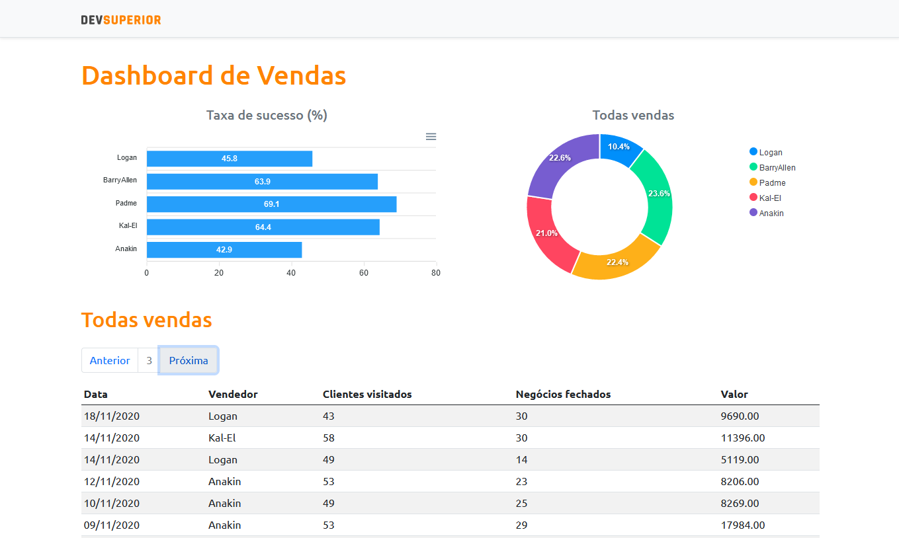
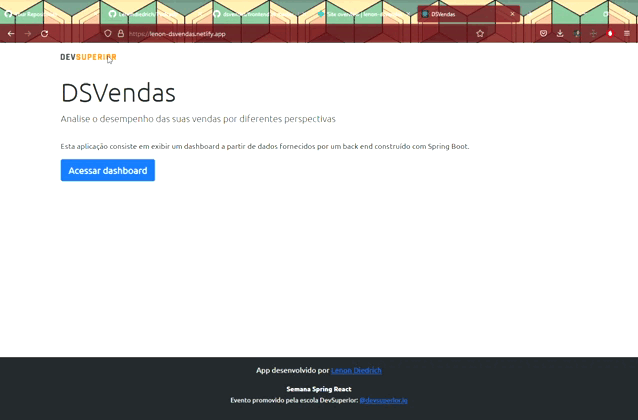

<h1 align="center">DSVendas</h1>
<h3 align="center">
  
  
  
  
  
</h3>
<h3>💻 Sobre: </h3>

Projeto desenvolvido na semana DevSuperior. O projeto consiste em uma aplicação de para ver o resultado de vendas

<h3>🛠 Tecnologias utilizadas: </h3>
<ul>
  <li>Java (JDK 16) </li>
  <li>Spring Framework (STS)</li>
  <li>ReactJs</li>
  <li>PostgreSQL 12</li>
  <li>Insomnia</li>
  <li>Heroku</li>
  <li>Netlify</li>
  
</ul

<h4>Acesse a aplicação rodando no Netlify aqui: -> <a href="https://lenon-dsvendas.netlify.app/">DSVendas</a></h4>
<h3>📟 Layout da aplicação:</h3>
  
   
  
  
<h3>⚙️ Instalação: </h3>

    # Clone o repositório
    $ git clone <https://github.com/Lenondiedrich/dsvendas>

<h4>Backend</h4>

Utilizando a IDE (Spring Tool Suite), altere o arquivo  `application.properties`, altere o perfil de `prod` para `test`, então rode a aplicação pela IDE do Spring.

<h4>Frontend</h4>

    # Navegue até o diretório frontend
    $ cd frontend

    # Instale as dependências da aplicação
    $ npm install ou yarn

    # Inicie a aplicação React
    $ npm start ou yarn start

A aplicação irá rodar no endereço `http://localhost:3000/`

<h3>📝 Licença</h3>

Este projeto está sob a licença do MIT

